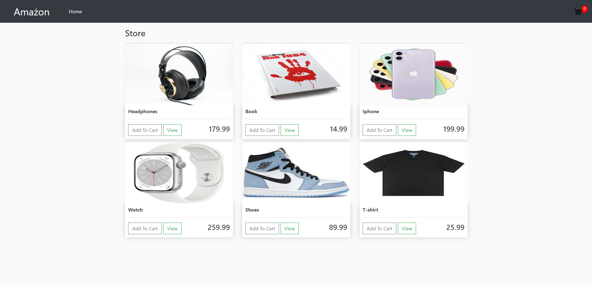
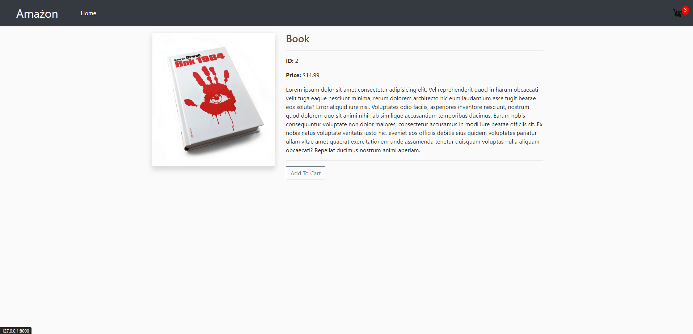
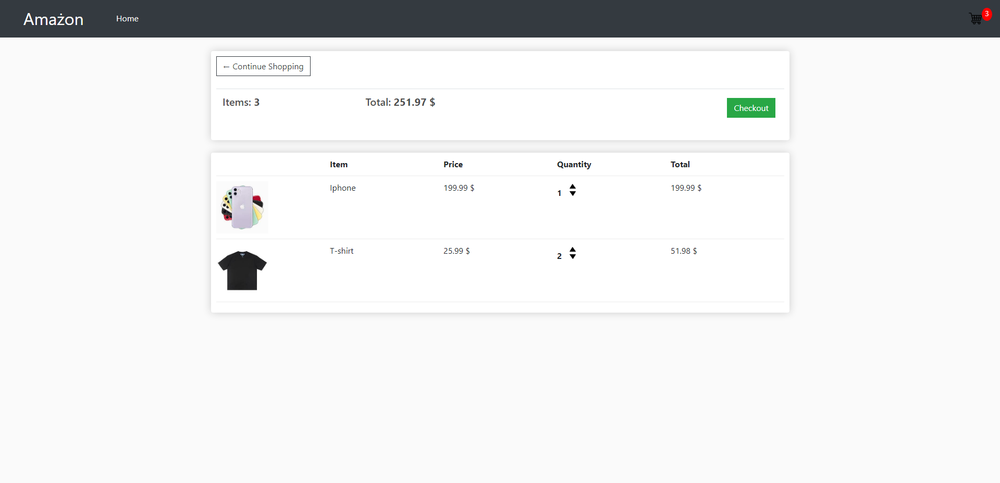
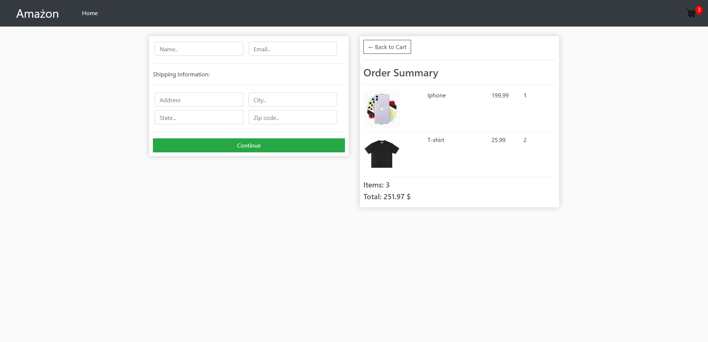

# E-Commerce_Django
The E-commerce application is a Django-based platform that offers user registration, payment processing, and shopping cart management. It provides a seamless and user-friendly experience for customers to browse, purchase, and manage their orders online.

### Built With
- Python
- Django
- JavaScript
- HTML & CSS & Bootstrap
- Railway
- PostgreSQL

## Key Features
  - Add to cart functionality
  - View specific items
  - After checkout, cart will be cleaned
  - Full responsive

